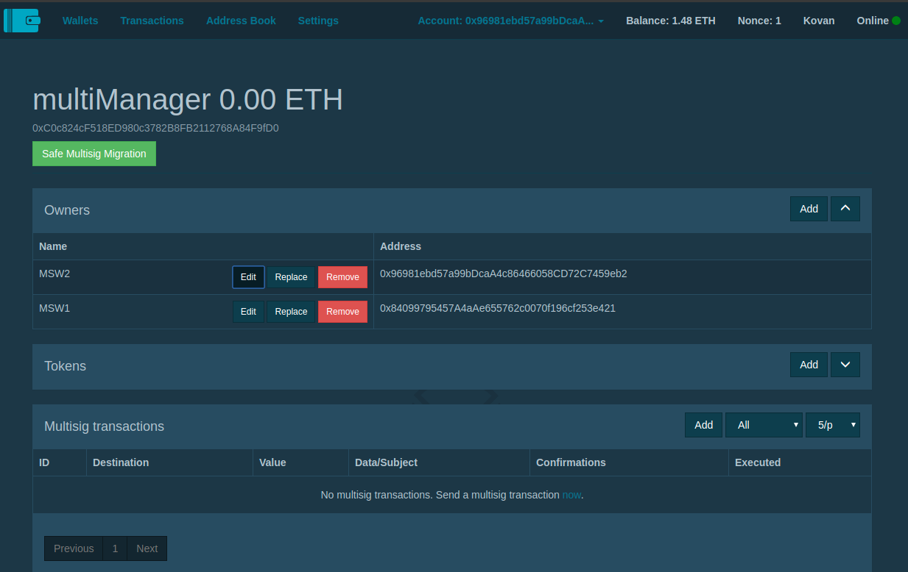
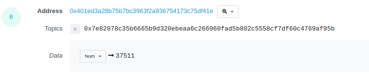

= multiManager module for @melonproject/protocol
Willie Laszlo Laubenheimer, blockchain@laubenheimer.eu
:toc:
:icons: font
:imagesdir: pix/


This module aims to enable multiple persons to manage a fund on the `@melonproject/protocol` from https://github.com/melonproject/protocol and the new interface to use the protocol is available here https://melon.avantgarde.finance/

<<<

== general information

The following functions are contained in the `multiManager-module`:

  - multiSigAddOwner
  - confirmTx
  - executeTx
  - beginSetupMSW
  - completeSetupMSW
  - makeOrderMSW
  - takeOrderMSW
  - cancelOrderMSW
  - returnAssetToVaultMSW
  - redeemMSW

To handle this module it is recommended to mostly advance the gasLimit when confirming a proposed multiSigTransaction, otherwise it will run outOfGas and you need to redo the confirmation.

TIP: After opening a `makeOrder`, the account is freezed for 30 minutes until one can make the next `makeOrder`

<<<

== preliminaries

Use metamask browser extension (https://metamask.io/) as wallet. There you also can export the PRIVATE_KEYs to integrate in the `.env.js` file. To get some kovan TESTNETether visit https://faucet.kovan.network/. In general the whole setup from scratch should work fine with `3 Ether`.

If the pricefeed is down, errormsg like here https://kovan.etherscan.io/tx/0x2c6e7789e3faeb6d7ed7b3b0732bf3965d47a035d5dd32e6b8272283e60a9266 then contact Midas Technologies AG or blockchain@laubenheimer.eu

First of all you need:

1. one invested fund (WETH and at least one other tradeable asset)
2. one multiSigWallet (min. 2 Owner)
3. one invested multiManager fund

=== 1. invested fund

To invest into a fund you need the `PRIVATE_KEYsrc` variable set with a minimum balance of 1.5 ETH.

Basically you can run `node runPoC` with the file like here https://github.com/Midas-Technologies-AG/MelonApp/blob/ad65b3c7e3df1f73cc0dbf27c8848efa78f2dc9c/Modules/multiManager/runPoC.js

It is just using `setupInvestedFund2` from the `melonWrapper`.

image::pic1.png[]

=== 2. multiSigWallet

Visit https://wallet.gnosis.pm/ and login/connect to MetaMask.

Create a new MultiSig Wallet:

1. give it a name
2. set confirmations to a minimum of 2
3. add at least one owner
4. deploy and confirm tx via MetaMask

Then copy the address of your wallet and add it to the `.env.js`-file.




=== 3. create MSWfund

Now you can run the same command as above, but with the file from here https://github.com/Midas-Technologies-AG/MelonApp/blob/1b07c21c16e9b598eb4c79866a900baf6e1e7199/Modules/multiManager/runPoC.js which basically executes those two funcions:

image::pic3.png[]

NOTE: Now you need to go to the multiSig wallet https://wallet.gnosis.pm/ and confirm first the beginSetup() function as well as wait until it is successfully executed before you confirm the second one. Otherwise the second fails and need to be executed again and so on.

IMPORTANT: change the gas while confirming with the second account

So you should see 9 tx like in this picture:

image::pic4.png[300, 500, align="center"]

Add a 4 in front of "Gas Limit":

image::pic5.png[400, 500, align="center"]


.Gas Costs
1. 2,703,244(https://kovan.etherscan.io/tx/0x0856bd39106cd96e5058b6244665689bc8e354fcd2990c3c699326be78b339cf)
2. 2,187,327
3. 1,540,364
4. 3,682,303
5. 1,260,900
6. 1,262,465
7. 4,057,974
8. 973,420
9. 3,118,282(https://kovan.etherscan.io/tx/0xbd4cfedaa5e6776849f0a0efd5eede1b76c1402fd2f15550776390b87d39c3fe)

Now you can run `console.log(await getRoutesOf(mswAddress))` and it will work fine:

```
  accounting: '0x256d8D56daE86185e1df8B6C8A243EdDdF7B9fEb',
  feeManager: '0x96FE31D8D74584c4e880dee29F9506f92A1A7ae2',
  participation: '0x8107AcC2aB89d8A1547A7270dE65e419000F7E5b',
  policyManager: '0xed65e9dE085892FfDBF1a323a4C5d4fae520f2f7',
  shares: '0xfA6910D269FE933F74E68c6D90881dAC820Aa420',
  trading: '0x401Ed3A28B75b7BC3963F2a936754173c75Df41e',
  vault: '0xCfF1bC99258b1f20e21762e132CDAce116B46B11',
  priceSource: '0x385a59e848f6456ADf19C367c8cf03FD39c23FAB',
  registry: '0xb8ACdbE95e9980fae93716ebA27709BCF1765A12',
  version: '0x160386e65C129C43AdA6496ED0ec2Ec63040f0Bc',
  engine: '0x8fe493CaF7Eedb3cC32aC4194ee41cBa9470e984',
  mlnToken: '0x2C2edf394638931eb672BD9261d2AA1934874d45'
```


==== 3.1 invest in MSWfund

We gonna invest from our baseAddress, because it is not possible yet to invest via a MSWwallet.

Before you run the same command as before send via metamask to '0xd0A1E359811322d97991E03f863a0C30C2cF029C' 1 Ether. This is the WETH contract and by default it will deposit you 1 WETH. After successfull confirmation use these commands/this file: https://github.com/Midas-Technologies-AG/MelonApp/blob/3bc07153ed19c2173d891a1428fe5a7b80a5de6a/Modules/multiManager/runPoC.js


== Proof of Concept

The following three functions are showing a fully functionable multiManager fund to trade ERC20-tokens using the @melonproject/protocol.

=== makeOrderMSW

image::pic6.png[]

1. run line 72 with any asset accepted and a tokenamount u want to buy (used commit 2521d7c)
2. confirm with other MSW owners (adjust gasLimit!)
3. check the 8th eventlog entry and make it visualize as number to get the order id created like here:

https://kovan.etherscan.io/tx/0x7f89442c22707296ba1d2e10722b2337a7583f6485e5fd6fb7fe48a95a32c4ce#eventlog



To be able to use `takeOrder` by the fund from 1. we need the asset in the fund for which we opened a order, so line 76 can execute successfully. Since we just have a fund without any assets as WETH we gonna use another fund with enough BAT.

The makeOrderMSW transaction can be seen here:

https://kovan.etherscan.io/tx/0x7f89442c22707296ba1d2e10722b2337a7583f6485e5fd6fb7fe48a95a32c4ce

and it got taken by the investedFund here:

https://kovan.etherscan.io/tx/0xf152928c6a44641c481ee391f287bb52d9b2ccf508f601588b383ce4b601d3a9


=== takeOrderMSW

First of all we need to have an openOrder we can use. Therefore we open a makeOrder from the fund having already BAT token.

image::pic8.png[]

Then run first line 90 and after your confirmation check the hodlings of MSW again. Here you see the takeOrderMSW transaction:

https://kovan.etherscan.io/tx/0xe39112e3414365478fe9ce527a10b0051e8df1cdbe8780b4a7d73a0558168e65


=== cancelOrderMSW

This is the quickest proof. Just create a makeOrderMSW + confirm https://kovan.etherscan.io/tx/0x2c8b9f19e5913f1ce09e9087d6189fdac66f0c842d077ef4ce6c8e2a3d13d6f9

and then directly cancel it via cancelOrderMSW + confirm via MSW https://kovan.etherscan.io/tx/0x09789da707e8b0c19206ca8fd20ce0612f3fbc2b0948e58206b588d821de6aa0

image::pic9.png[]

== next steps

- [ ] check if address is msw owner
- [ ] invest in fund from multisig
- [ ] timer for checking if makeOrder is possible
- [ ] integration to existing products in the ecosystem
